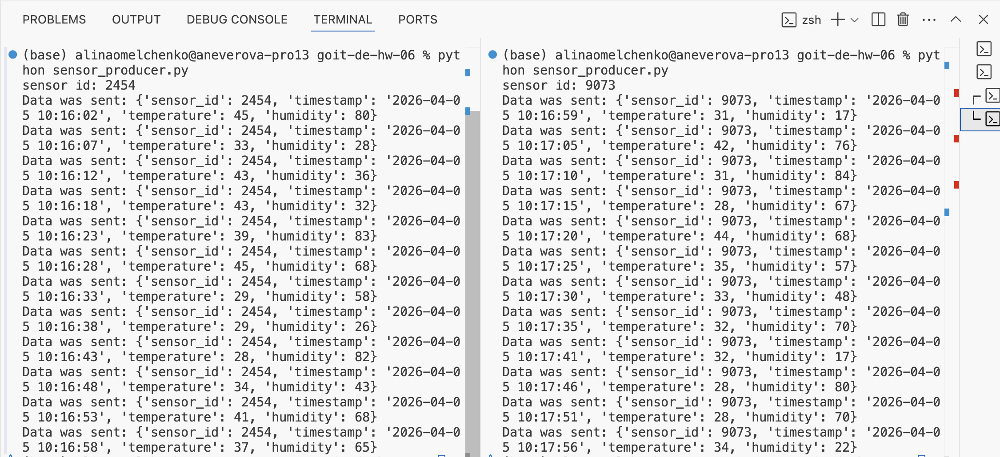
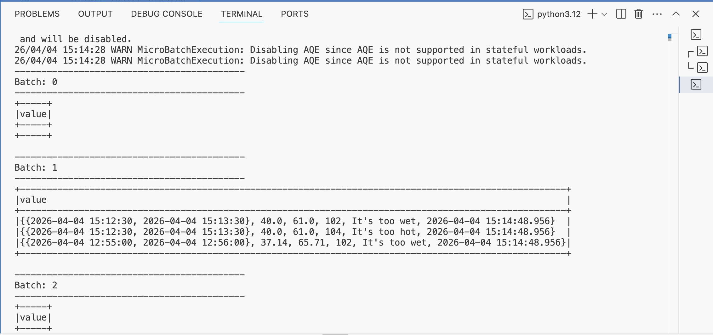
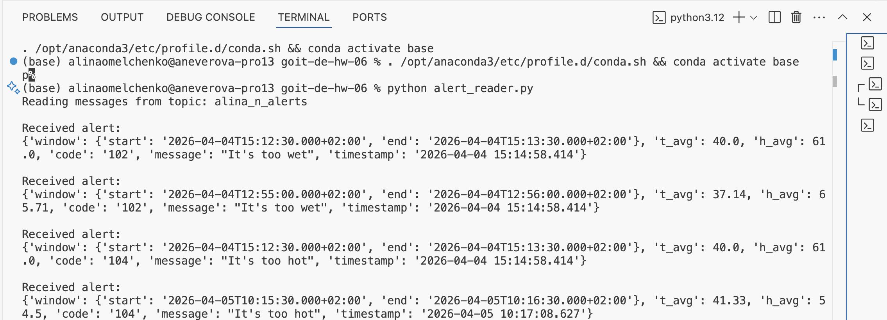

### 1. Генерація даних сенсорів та відправка даних у топік building_sensors

### 2. Обробка стріму даних у Spark, агрегація та формування alert повідомлень

### 3. Читання alert-повідомлень з топіка alerts

